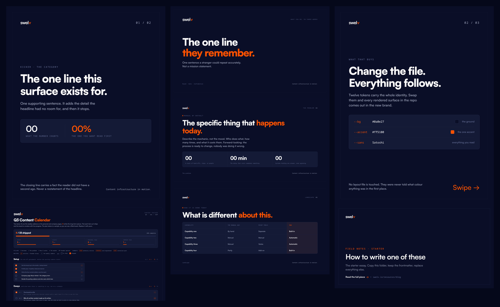

<p align="center">
  <picture>
    <source media="(prefers-color-scheme: dark)" srcset=".github/swelv-logo-dark-bg.svg" />
    
  </picture>
</p>

<h1 align="center">swelv studio</h1>

<p align="center"><strong>The content studio we run our company on. Debranded, and given away.</strong></p>

<p align="center">
  Social posts, brand assets, decks, videos and essays — written and rendered by
  an AI agent that already knows your brand, from a terminal, with no design
  tools and no subscriptions.
</p>

<p align="center">
  <a href="#quickstart">Quickstart</a> ·
  <a href="#what-you-get">What you get</a> ·
  <a href="#how-it-works">How it works</a> ·
  <a href="docs/writing-rules.md">The writing rules</a> ·
  <a href="LICENSE">MIT</a>
</p>

<p align="center">
  
</p>

<p align="center"><sub>Everything above came out of a fresh clone, unedited, in the brand the repo ships with. An agent replaces that with yours in about five minutes.</sub></p>

---

## Why this exists

We built this to make [swelv](https://swelv.io)'s content: every LinkedIn post,
every investor deck, every product video. It turned out the useful part was never
our brand — it was the machine around it. So we took our brand out and left the
machine.

What makes it work is not the rendering. It is that **the brand is a file**. One
CSS file holds the colours, type and geometry; one markdown file holds the voice,
the positioning and the rules about what you may and may not claim. Every surface
in the repo reads those two. An agent writing a post at 11pm makes the same
decisions your designer would, because the decisions were already made and
written down.

The rest is a rendering pipeline that turns HTML into PNGs, PDFs and MP4s, which
is a solved problem and not the interesting bit.

## Quickstart

You need [Claude Code](https://code.claude.com/docs), `git`, and Google Chrome.

```bash
git clone https://github.com/swelv-lab/swelv-studio-template.git
cd studio
claude
```

Then, in the session:

```
/setup-brand
```

An agent interviews you — colours, type, logo, voice, positioning, what you must
never claim — and writes your brand kit. Point it at your website and it reads
most of that off the site itself.

After that, describe what you want:

> *"Make a carousel about why our onboarding takes a day instead of a month."*

You get the images, the caption, and the files, on brand, without opening a design
tool.

## What you get

| Command | What it makes |
| ------- | ------------- |
| **`/setup-brand`** | Your brand kit — the interview that makes everything else on-brand |
| **`/new-post`** | Social posts: carousels, stat cards, glossary cards, any network |
| **`/new-collateral`** | OG images, banners, presentation covers, one-pagers, email footers |
| **`/new-deck`** | 16:9 slide decks, rendered to PNGs and one shareable PDF |
| **`/new-video`** | MP4s with synthesized sound and a branded sign-off — or your screen recording, brand-framed |
| **`/new-essay`** | Long-form articles: a branded page, hero/OG card, and social share kit |
| **`/calendar`** | A content calendar that is also a shareable board |
| **`/reference-section`** | A post that reproduces a real section of your live site, exactly |

Plus two documents that are the actual opinionated content here:

- **[`docs/design-rules.md`](docs/design-rules.md)** — how to use a brand without
  the result looking generated. Includes the AI-slop list: icons in circles,
  three-column feature grids, decorative blobs, centered-everything.
- **[`docs/writing-rules.md`](docs/writing-rules.md)** — how to write copy that
  does not read as machine-written. The banned antithesis pair (*"X is A. Y is
  B."*), the aphorism ban, the punch-fragment ban, and caption rules with a
  hard 90-word cap on carousels.

Those two files are most of the value. Read them even if you never clone this.

## How it works

```
brand-kit/brand.css        colours · type · geometry · the logo, as one mask
brand-kit/BRAND.md         voice · positioning · what you must never claim
brand-kit/brand.json       the brand's strings, for the places code needs them
        │
        ▼
posts/ collateral/ decks/ content/ calendar/
        │            self-contained HTML, one file per surface
        ▼
   headless Chrome  →  PNG · PDF · MP4
```

Three properties make it hold together:

1. **One file per surface, no build step.** A post is one HTML file. An agent can
   write it, render it, *look at the PNG*, and fix it — with no state anywhere
   else and nothing to keep in sync.
2. **Layout is local, brand is global.** A surface's `<style>` block is for layout
   only. The moment a hex code appears outside the brand kit, a rebrand stops
   being one edit. Everything you see in the screenshot above was a dark navy
   fintech brand until one file changed.
3. **Video is just stills.** An animated post is HTML that draws frame `t` as a
   pure function of `t` — sequenced with a paused GSAP timeline when there is a
   lot going on, by hand when there is not. Chrome screenshots every frame,
   ffmpeg encodes it, and the sound is synthesized from a small JSON cue file.
   No editor, no timeline app, no assets to license.

## Requirements

| For | You need |
| --- | -------- |
| Images, decks | Google Chrome (`google-chrome-stable`, `google-chrome`, or `chromium`) |
| Decks → PDF, essays | ImageMagick (`magick`) |
| Essays | python3 with `pyyaml` and `markdown` |
| Video | `ffmpeg`, plus `npm install` once for the fast renderer |

Nothing is hosted, nothing phones home, and nothing here can deploy anywhere.

## What's in the box

```
studio/
├── brand-kit/       YOUR BRAND. Tokens, voice, logo, fonts. Start here.
├── docs/            The design and writing rules. Brand-independent, and binding.
├── posts/           Social posts + the video pipeline
├── collateral/      OG images, banners, covers, one-pagers
├── decks/           16:9 slides → PDF
├── content/         Essays: markdown → branded page + hero + share kit
├── calendar/        The content board
├── examples/        Finished work, made with this studio (read-only)
├── reference/       Optional: a read-only copy of your site, docs and app, so content matches
└── .claude/skills/  The commands above
```

## About the brand it ships with

`brand-kit/` arrives filled in with **swelv's own** — the navy, the orange, the V
mark, the type — because a scaffold full of `TODO` teaches you nothing about what
a finished brand kit looks like. Every screenshot above came out of it.

It is there to be replaced, not reused. `/setup-brand` overwrites it on the first
session, and until you run it, anything you render carries swelv's marks. See
[TRADEMARK.md](TRADEMARK.md).

The `_template/` folders are the opposite: deliberately empty scaffolds with
placeholder copy, so you can see the shape of a surface without inheriting
somebody's words.

## Licence

The software is **MIT** — fork it, change it, sell what you make with it. See
[LICENSE](LICENSE).

The swelv name and logo are not part of that grant; they are here to say who
built this. See [TRADEMARK.md](TRADEMARK.md).

---

<p align="center">
  <sub>Built and open-sourced by <a href="https://swelv.io"><strong>swelv</strong></a> — capital infrastructure in motion.</sub>
</p>
